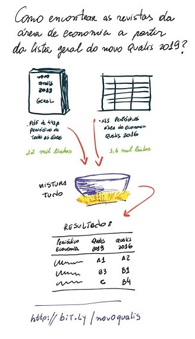

# Qualis 2019 - preliminar 


Disponibilizo duas tabelas em *Excel*: uma com o provável **novo Qualis 2019 geral** para todas as áreas e a outra, a lista dos **periódicos da área de Economia** com as respectivas classificações Qualis 2016 e 2019. 
As planilhas foram criadas a partir de [um arquivo pdf de 400+ páginas que circulou pelas redes sociais](https://capes.gov.br/36-noticias/9735-nota-sobre-o-qualis) em meados de julho de 2019. 



Este repositório (atalho: http://bit.ly/novoqualis) traz as informações e procedimentos para recriar as planilhas *Qualis Economia 2019* e *Qualis Geral 2019*. 
Com vistas à reprodutibilidade, o fluxo de trabalho procurou seguir as recomendações do [*Project TIER*](https://www.projecttier.org/) e mais especificamente o [TIER Documentation Protocol v3.0 for R](https://github.com/ProjectTIER/ProjectTIER_R). 

O projeto foi iniciado por [Enoch Filho](http://www.enochfilho.net/) como um exercício para praticar o manuseio, arrumação e transformação de dados com o uso do `R`, do `Git`, do `GitHub`, do *`TIER Protocol`*. 
O status é *work-in-progress*. 
Uma versão das planilhas já está disponível. 
Não há garantias, mas é provável que haja melhorias, mudanças no código, documentação, etc. 
A comunidade é bem-vinda para revisar e aperfeiçoar o código (por meio de [issues](https://github.com/enoches/Qualis_2019_preliminar/issues) e `pull requests` ) e livre para reutilizar o material. 

Os arquivos no formato *`.xlsx`* podem ser baixados diretamente nestes links: 

- [**qualis_geral_2019.xlsx**](https://github.com/enoches/Qualis_2019_preliminar/raw/master/qualis_geral_2019.xlsx) 
    - Versão: 1.0.0
    - Atualizada em (yyyy-mm-dd): 2019-08-27

- [**qualis_economia_2019.xlsx**](https://github.com/enoches/Qualis_2019_preliminar/raw/master/qualis_economia_2019.xlsx) 
    - Versão: 0.1.1
    - Atualizada em (yyyy-mm-dd): 2019-08-10
    
Disclaimer: nessa versão da planilha (0.1.1) os dados foram pareados pelo ISSN. 
Várias revistas aparentemente tiveram seus ISSN alterados, então na próxima versão da planilha será preciso fazer também a junção pelos nomes das revistas, e assim tentar identificar os periódicos que faltam.


### Software utilizado

O software utilizado foi o R versão 3.6.0 e o RStudio 1.2.1335


## 1. Pastas e arquivos 


- O arquivo `README.md` com informações gerais (este arquivo). 
- Qualis Economia 2019 - `qualis_economia_2019.xlsx`
- Qualis Geral 2019 - `qualis_geral_2019.xlsx`

- Dados Originais e Metadados/ - `dados-originais`
    + `classificacoes_publicadas_economia_2017_1496941693861.xls`
    + `Qualis novos 1907.pdf`
    + Metadados/ - `metadados`
        - Guia de Metadados - `guia de metadados.md`
        - Suplementos/ - `suplementos`

- Processamento e Análise/ - `processamento-e-analise`
    + Dados a importar/ - `dados-a-importar`
        - `Qualis-novos-1907_drv.txt`
    + Arquivos com comandos/ - `arquivos-com-comandos`
        - `01-montar-base-novo-qualis.R`
        - `02-lista-qualis-2016-economia.R`
        - `03-processa-novo-qualis-economia.R`
        - `04-gera-arquivo-qualis-economia-219.R`
    + Dados da Análise/ - `dados-da-analise`
        - `data.appendix.Rmd`
        - `novo_qualis_preliminar.rds`
        - `qualis_economia_2016.rds`
        - `qualis_economia_2019.rds`


## 2. Modificações nos arquivos para importação

O arquivo `Qualis-novos-1907_drv.txt` está na pasta `dados-a-importar/` e foi derivado do arquivo original `Qualis novos 1907.pdf`.
É o arquivo que contém a novo Qualis 2019, provavelmente se trata do Qualis-Referência, segundo a nova metododologia da CAPES. 
Abri o arquivo original, em pdf, em um leitor de pdf e utilizei a opção "Salvar Como" txt (texto puro). 
O arquivo resultante se apresenta da seguinte forma: 

```
----------------------- Page 1-----------------------

   ISSN                                     TITULO                                   ESTRATO 

  2237-5953    (RE) PENSANDO DIREITO                                                  B4 

  2469-4312    [IN] TRANSITION                                                        B2 

1981-030X      19&20 (RIO DE JANEIRO)                                                 B1 

```


## 3. Instruções para replicação

Supondo que tenha instalado o R, basta rodar os quatro scripts da pasta `processamento-e-analise/arquivos-com-comandos/` na ordem em que aparecem.

Lorem ipsum lorem ipsum...

.
